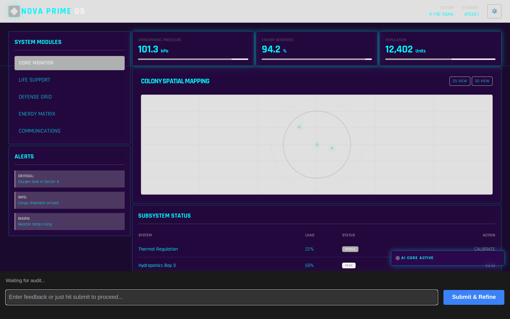
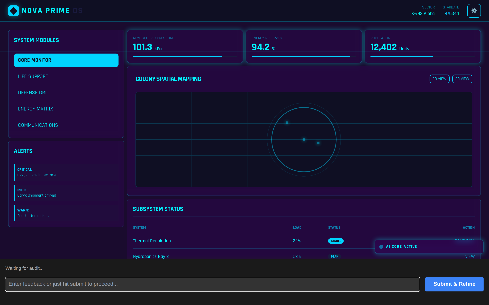
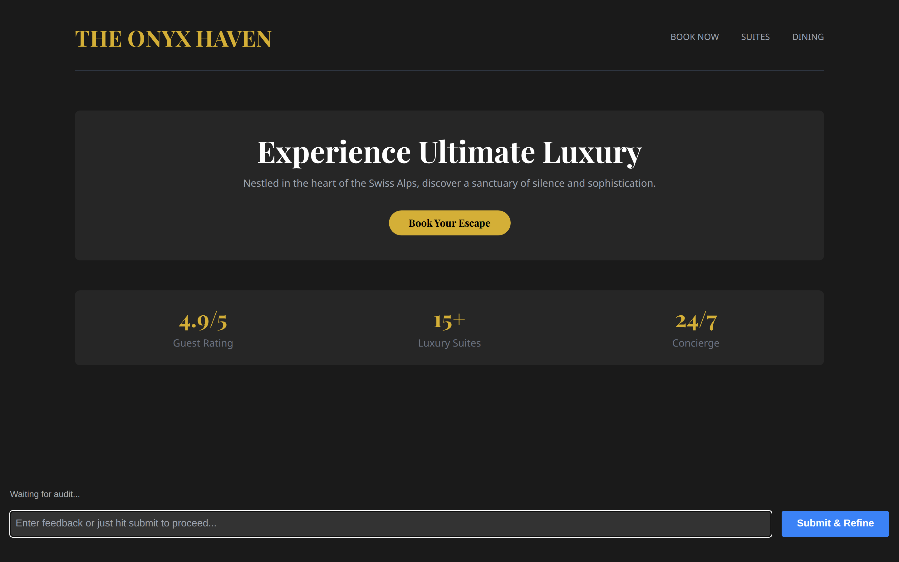
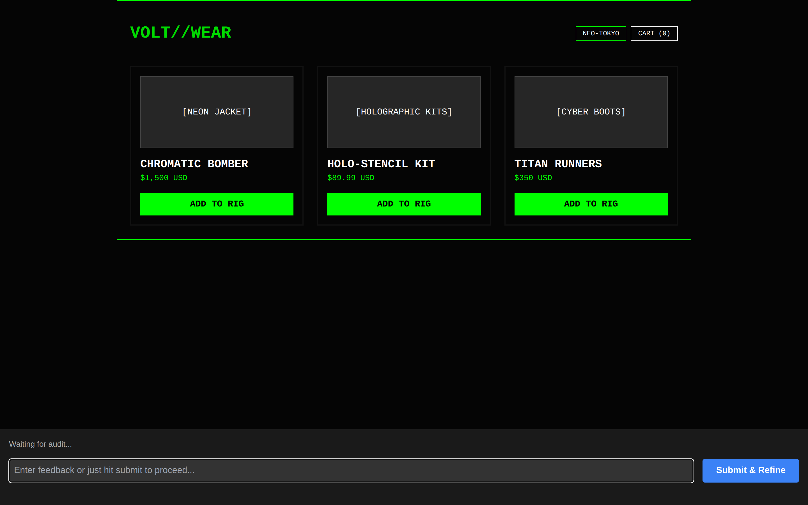
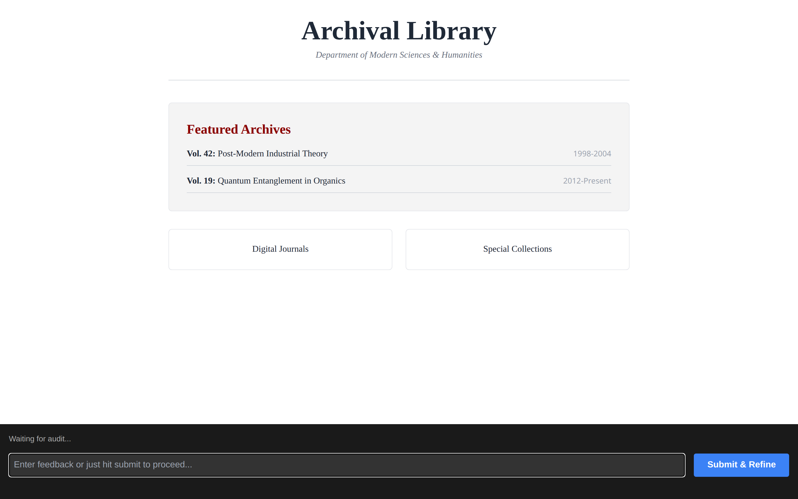

# StyleSentry 🛡️

**A visual-first design loop that generates UIs from a text prompt, then audits its own output at every breakpoint and interaction state — and refuses to drift from your brand.**

StyleSentry pairs a code-generating "Brain" with a vision-model "Eyes" auditor. You describe an interface in plain language; it locks a set of **design tokens** (the brand "truth"), generates HTML/CSS constrained to those tokens, screenshots the result across breakpoints, overlays, and hover/focus states, and scores every one. Feedback goes back to the model until the design converges — with the tokens held immutable so colors, type, and spacing don't wander from iteration to iteration.

It runs against any OpenAI-compatible or Ollama endpoint, and the human stays in the loop the whole way through a live browser shell.

## The loop in action

| 1. Regression caught | 2. Converged |
| :---: | :---: |
|  |  |
| A token tweak washes out the panel and leaves the active nav item grey-on-grey — the auditor flags the contrast failure. | The corrective loop restores the tokens and the layout converges. |

---

## How it works

```
intent ──▶ [Brain] generate ──▶ render (Playwright) ──▶ [Eyes] visual audit ──▶ score + bugs
             ▲                                                                      │
             └──────────────── refine (your feedback + audit findings) ◀───────────┘
```

- **Design Token Lock.** Tokens split into **hard** (immutable brand identity — primary colors, main font) and **soft** (tweakable — accent color, radius, spacing). They're injected into every generation prompt as mandatory constraints, so the model can't invent arbitrary hex codes.
- **Natural-language token edits.** Tokens are derived from your intent automatically, then adjustable mid-run in plain language ("make the accent a deep neon purple"). A token edit that drops the audit score by more than 15 points or introduces a critical bug is corrected before any HTML is touched.
- **Multi-cell visual audit.** Every candidate is screenshotted and scored across the full matrix: three breakpoints (mobile 375px, tablet 768px, desktop 1280px) × every declared view (`data-view`) × overlays captured open (`data-state`) × forced hover/focus states. The composite score is the *worst* cell, so a mobile regression or a broken drawer can't hide behind a good desktop render.
- **Human-in-the-loop refinement.** A live design shell lets you steer with plain-language feedback, step back with `UNDO`, and finish with `DONE` — which exports a fully self-contained `final_result.html` (CSS, fonts, and compiled Tailwind inlined).
- **Crash-safe.** Every iteration snapshots under `run_state/`; if the loop dies, the next start offers to resume. Every finished run writes a self-contained trajectory report to `reports/`.

## One engine, many identities

The same orchestrator produces radically different looks — the token lock keeps each one internally consistent, and every one is held to the same audit and focus-visible gate. All three were generated by the identical loop, differing only in the prompt:

| 💎 Luxury hospitality | 🤖 Cyberpunk storefront | 🎓 Academic portal |
| :---: | :---: | :---: |
|  |  |  |
| Gold accents, deep charcoal, serif type. | High-contrast neon, monospaced, sharp borders. | Stark whites, generous whitespace, classic serif. |

---

## Quick start

### Prerequisites

- **Python 3.12+**
- **Node.js 18+** (Playwright renders the pages deterministically)
- **An LLM endpoint.** Either a local/hosted **[Ollama](https://ollama.com)** server or any OpenAI-compatible provider (OpenRouter, OpenAI, Anthropic, DeepSeek). The auditor needs a **vision-capable** model.

### Install

```bash
git clone https://github.com/lbijeau/visual-design-loop.git
cd visual-design-loop

# Python deps
pip install -r requirements.txt

# Node + browser
npm install
npx playwright install chromium
```

### Configure a provider

The default model is `gemma4:31b-cloud` on a local Ollama endpoint. Pick one of:

**Option A — local Ollama (simplest).** Point at your endpoint via environment variables and pull a vision model:

```bash
export OLLAMA_HOST="http://localhost:11434"   # default
export OLLAMA_API_KEY=""                        # only for hosted/cloud Ollama
ollama pull gemma4:31b-cloud
```

**Option B — the provider wizard (for cloud providers).** Start the app (below), open `/provider_wizard.html` in the browser, and add a provider + API key there. Config is written to a local `providers.json` (mode `0600`, git-ignored — never commit it).

Roles are configurable: the **brain** (code generation) and the **eyes** (vision audit) can point at different providers.

### Run

```bash
python3 orchestrator.py "A single-origin coffee subscription landing page, warm and editorial"
```

Then open the URL it prints (e.g. `http://localhost:8000/design_shell.html`) and drive the loop from the shell.

Flags:

| Flag | Meaning |
|---|---|
| `--max-iterations N` | Iteration budget (default 5) |
| `--port P` | Base port; hunts `P..P+100` (default 8000) |
| `--resume` / `--fresh` | Continue or discard an interrupted run (default: prompt) |
| `--reference PATH_OR_URL` | Seed the theme and first draft from a screenshot or a live URL (fresh runs only) |
| `--reconfigure` | Always open the provider wizard, even when the saved config already works |
| `--auto` | Run unattended: refine from the audit alone until it converges or the budget runs out |

When `providers.json` already resolves the brain and eyes roles to reachable models, the run uses it and starts immediately — so a CLI run needs no browser. The wizard is offered only when there is nothing saved, or when what is saved no longer works; `--reconfigure` opens it on demand.

An optional `start.sh` launches the orchestrator detached; edit its hard-coded intent before using it. Its `providers.json` push is no longer needed to get a run started.

### Unattended runs

`--auto` never waits for feedback. At each gate it refines from the audit findings alone, pointed at the worst-scoring cell — the one holding the composite score down — and repeats until the design converges or `--max-iterations` is spent:

```bash
python3 orchestrator.py "a pricing page" --auto --max-iterations 5
```

It exits **0** when the design converges and **1** when the budget runs out first, so a pipeline can gate on it. An interactive run that you finish with `DONE` also exits 0. `--auto` requires an intent argument, since nothing can answer the web shell's prompt.

### Seeding from a reference

Pass a screenshot or a live URL to seed the run's palette and first layout:

```bash
python3 orchestrator.py "a dog-walking service" --reference ~/Desktop/pricing-page.png
python3 orchestrator.py "a dog-walking service" --reference https://example.com/pricing
```

The reference sets the design tokens and the structure of the first draft — hierarchy,
section order, density — while the intent alone decides what content is on the page. It
is a starting point, not a target: the audit still scores against the intent, so
resemblance is expected to fade over successive iterations.

Requires a vision-capable brain model; the run aborts up front if the configured model
cannot read an image, rather than silently ignoring the reference. `--reference` cannot
be combined with `--resume`, because seeding only happens on a fresh run.

---

## The workflow

1. **Iterate.** Give layout or theme feedback in plain language ("move the nav left, add hero padding"; "lighten the primary 10%"). Theme changes run through a corrective validation gate — if a token edit drops the audit score by more than 15 points or introduces a critical bug, the tokens are corrected *before* any HTML is touched.
2. **Finish.** `✓ Accept & Finish` (or `DONE`) exports the self-contained `final_result.html`. `↩ Undo` (or `UNDO`) steps back one iteration, repeatable to the first draft.

Tokens are generated from your intent without an approval step — the loop goes straight from intent to first draft, and you steer from there.

Intents that imply multiple screens or overlays ("an admin app with dashboard, users, and settings") generate a single-file app whose views are tagged with `data-view` / `data-state`; convergence then requires *every* view, breakpoint, and interaction state to pass.

---

## Project map

| File | Role |
|---|---|
| `orchestrator.py` | CLI entry point — wires the preview server and the loop together |
| `loop.py` | The brain: manages iteration, refinement, and state |
| `server.py` | Live preview server — design shell + status/audit/feedback endpoints |
| `llm_client.py` | Single LLM transport (Ollama & OpenAI-compatible dialects, retries, fallback) |
| `visual_audit.py` | The quality gate — analyzes screenshots into a structured bug report |
| `provider_config.py` | Reads/resolves `providers.json`; maps brain/eyes roles to providers |
| `capture.js` | Playwright renderer — discovers and captures every tagged view/state |
| `status.py` | Thread-safe shared state between loop and server |
| `config.py` | Paths, ports, breakpoints — all cwd-independent |
| `design_shell.html` | The human-in-the-loop interface |
| `provider_wizard.html` | Browser UI for configuring providers and API keys |

The visual auditor returns a structured JSON report — `overall_score` (0–100), `bugs` (each with severity `critical` / `important` / `minor`), and a natural-language `summary` — which is fed back to the model for correction. Add rules by editing `visual_audit.py`.

---

## Development

```bash
pip install -r requirements.txt pre-commit
pre-commit install     # ruff, prettier, gitleaks, and hygiene hooks on every commit
pytest                 # run the test suite
```

Linting and formatting are enforced by [ruff](https://docs.astral.sh/ruff/) (config in `pyproject.toml`); CI runs the same checks plus the full test suite on every push (`.github/workflows/ci.yml`).

## Provenance

This repository is a standalone extract of the `visual-design-loop` project from a private monorepo. It starts from a clean snapshot — no upstream history is carried over.

## License

[MIT](./LICENSE) © 2026 Luc Bijeau
